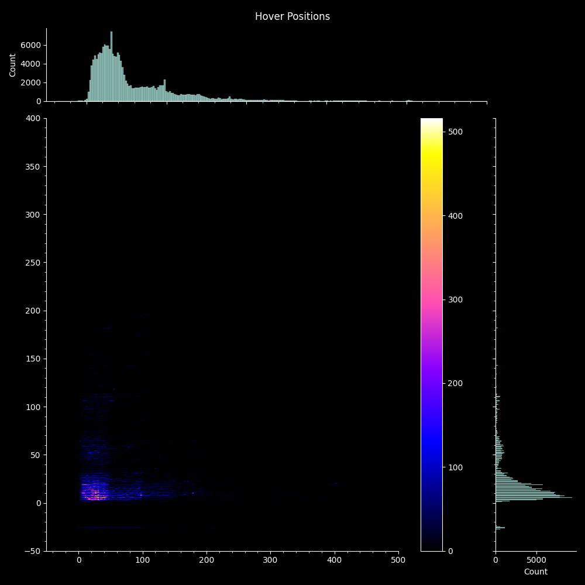
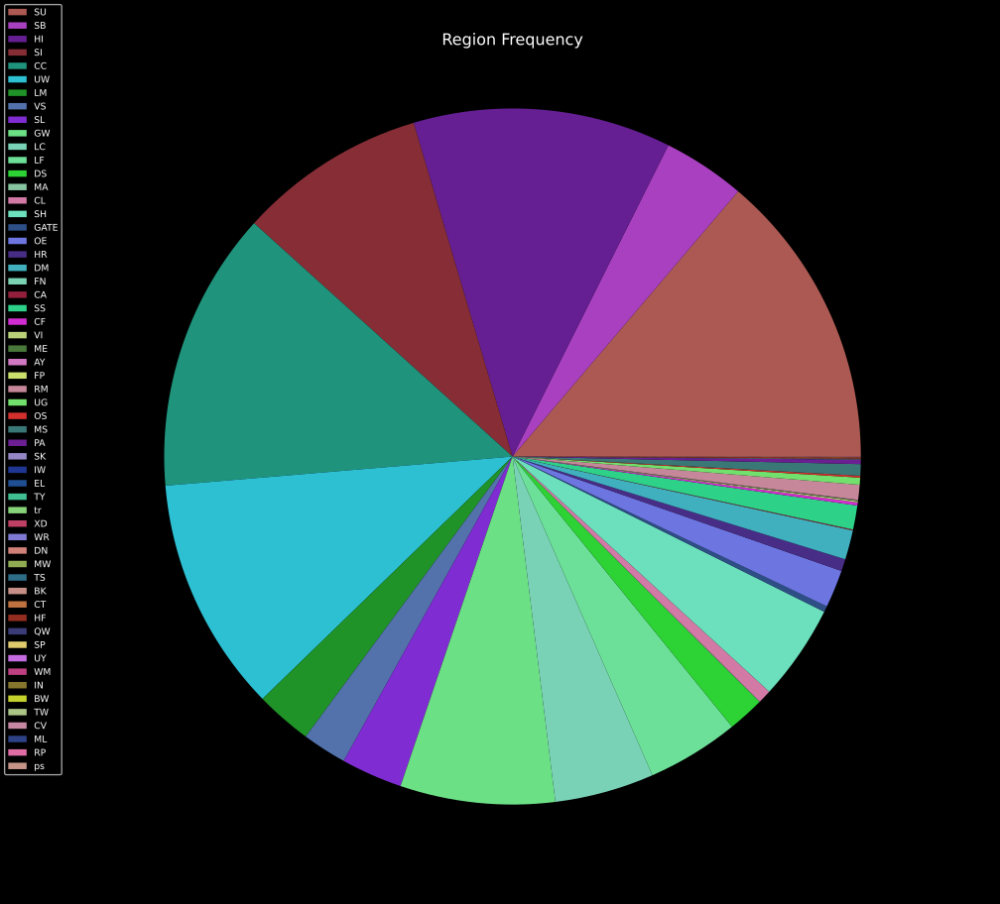
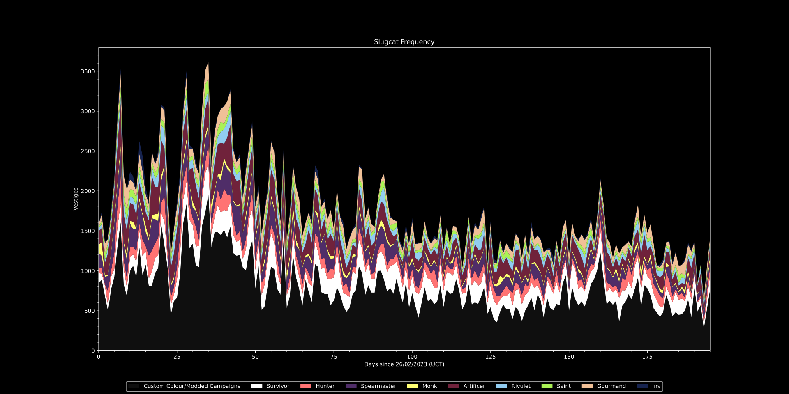
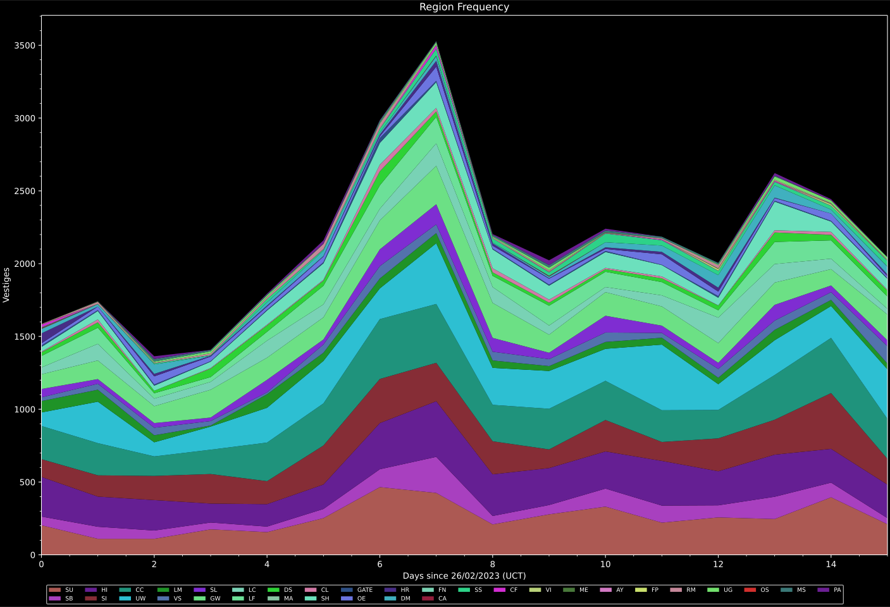
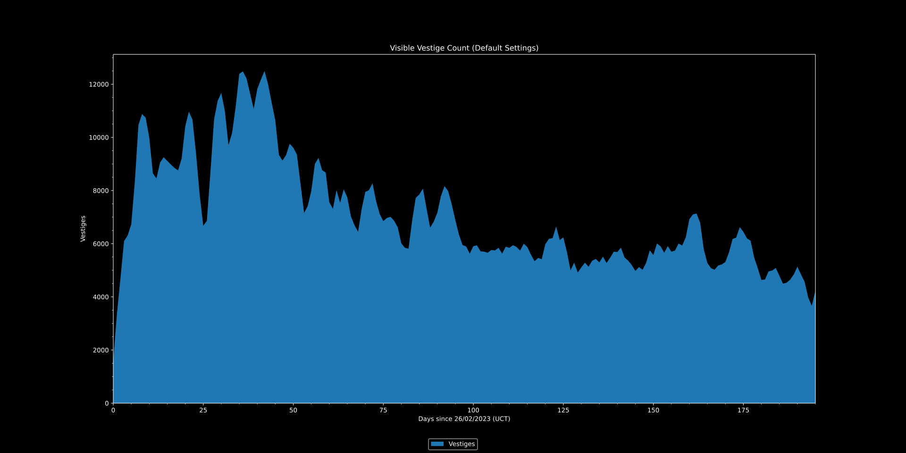
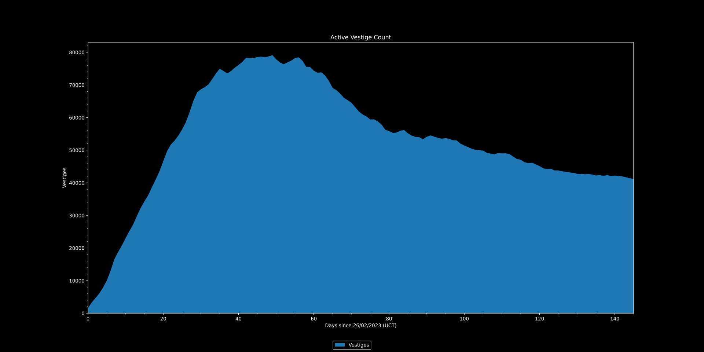
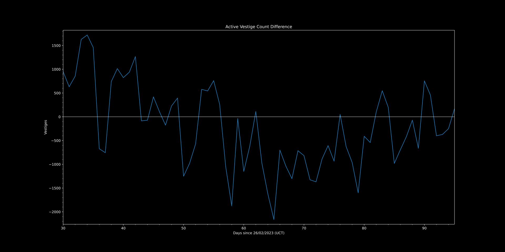
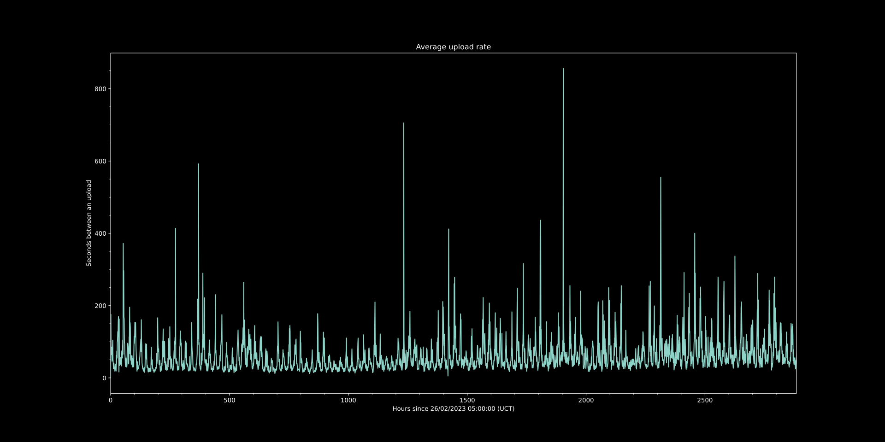

# VestigeBackup
 A backup containing [Vestiges](https://github.com/FrostBird347/Vestiges) older than a month.

[Raw download link](https://raw.githubusercontent.com/FrostBird347/VestigeBackup/master/VestigeBackup.csv)

While there is a custom script contained within this repo to update the backup, it is not being run automatically and thus won't ever be fully up to date.

----

Graphs:

	
	
	 
	
	

